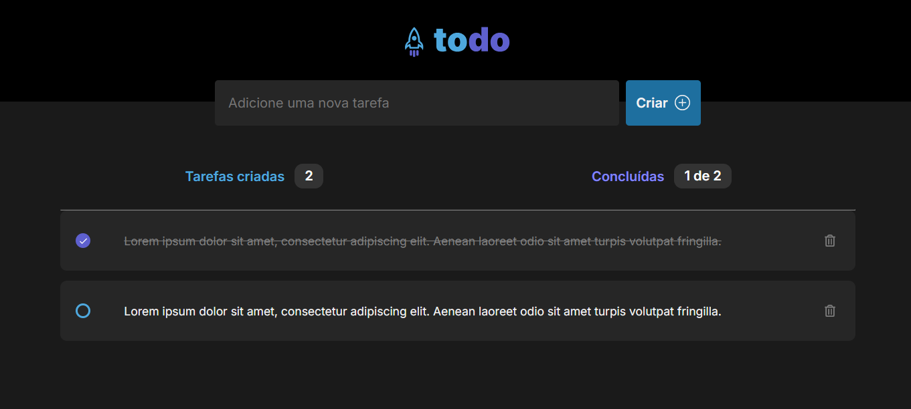

# Todo App - React + TypeScript + Vite

Este é um simples aplicativo de gerenciamento de tarefas, desenvolvido com React, TypeScript e Vite durante a trilha de React JS da Rocketseat.



## Funcionalidades

- **Criar Tarefas**: Adicione novas tarefas à lista.
- **Marcar como Concluída**: Marque uma tarefa como concluída.
- **Excluir Tarefas**: Remova tarefas da lista.
- **Persistência no Local Storage**: Todas as tarefas são salvas no local storage, garantindo que as informações sejam mantidas mesmo após a atualização da página.

## Acessar o App

O aplicativo está em deploy na seguinte URL:

[https://todolist-virid-six.vercel.app/](https://todolist-virid-six.vercel.app/)

## Como Executar

Se quiser rodar o projeto localmente:

Clone este repositório:
   ```bash
   git clone https://github.com/salesmiguelz/todolist-react
  ```
Instale as dependências:
  ```bash
  npm install
  ```
Execute o projeto:
```bash
npm run dev
```